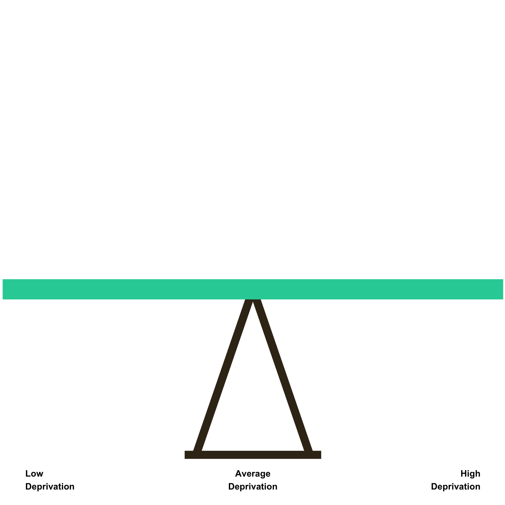
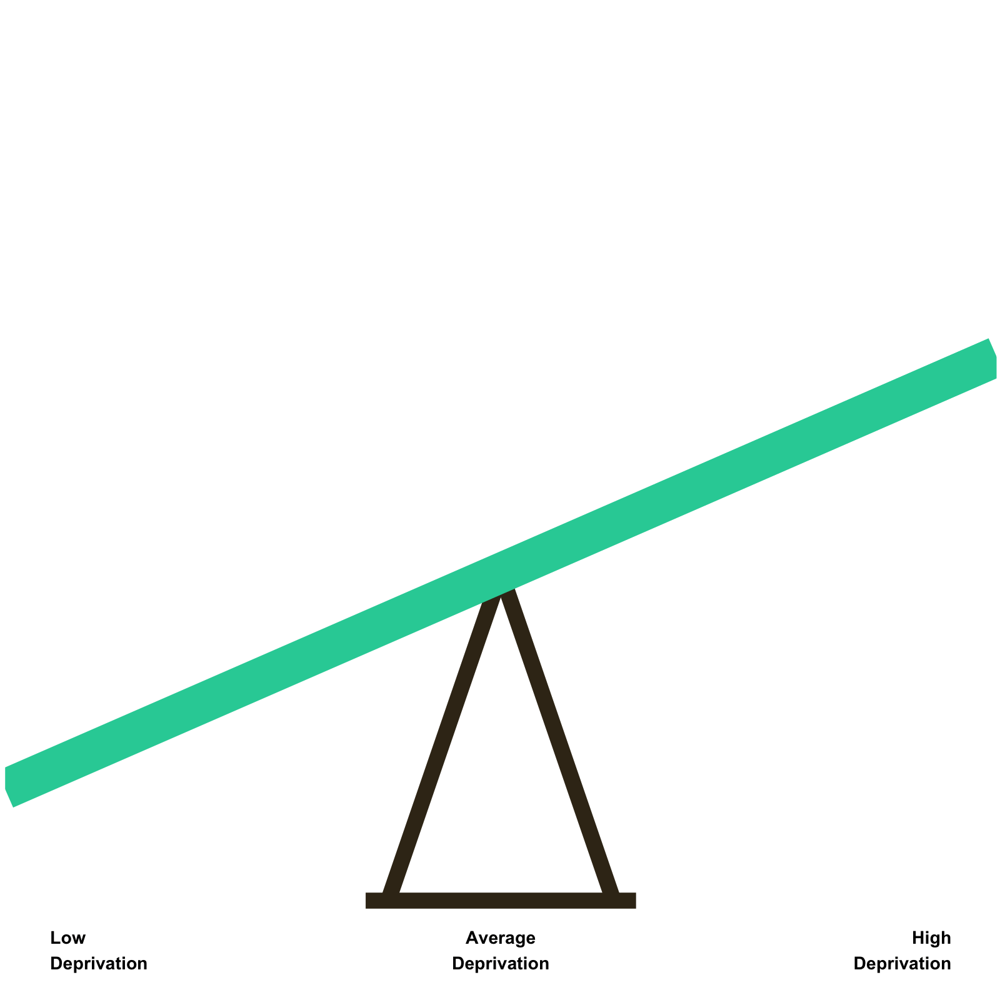
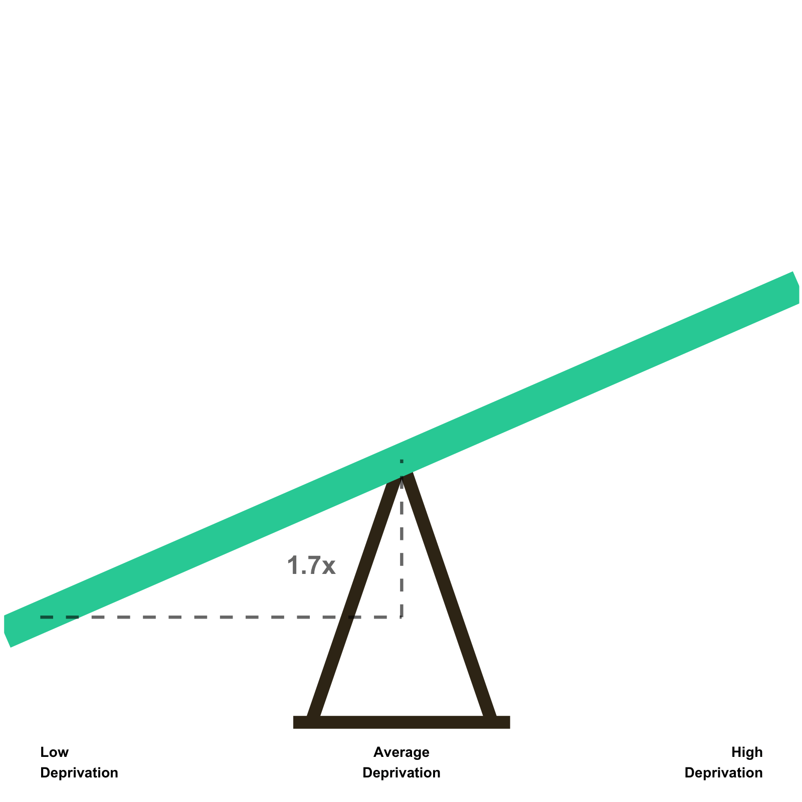
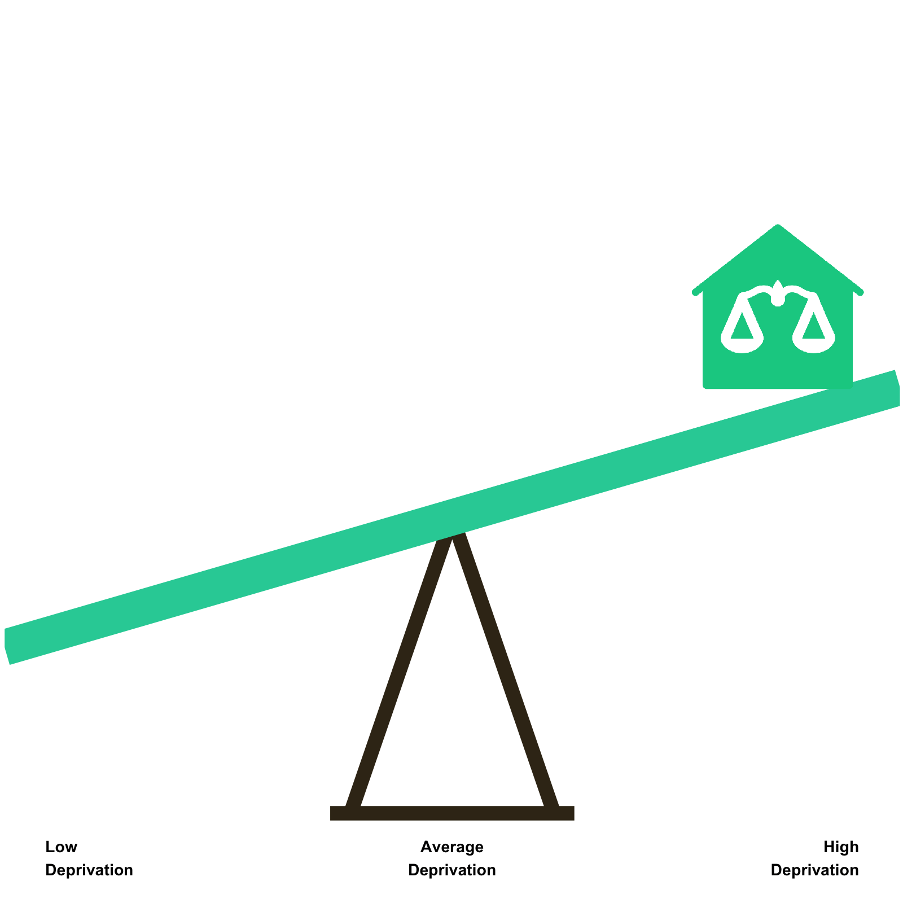
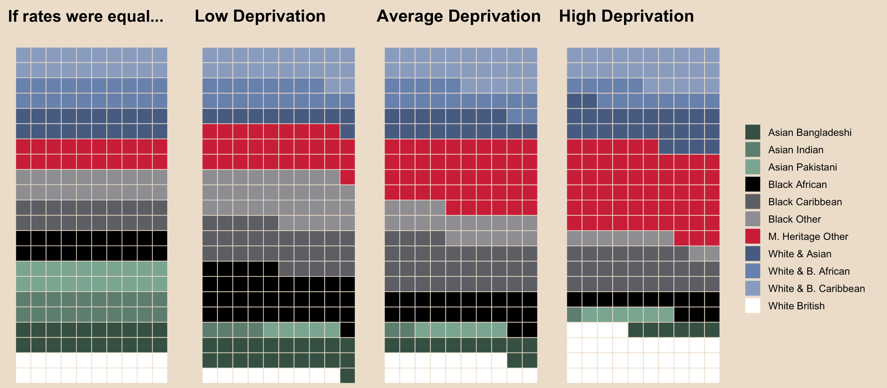

class: hide_logo, bottom
background-image: url(images/cbw-bg-wide.png)
background-size: contain


```{r setup, include=FALSE}
library(xaringan)
library(xaringanthemer)
library(xaringanExtra)
library(tidyverse)
library(plotly)
library(ggdark)
library(formattable)
library(data.table)
options(htmltools.dir.version = FALSE)
knitr::opts_chunk$set(warning = FALSE, message = FALSE) 
```

```{r xaringan-logo, echo=FALSE}
xaringanExtra::use_logo(
  image_url = "images/uni-sheffield.png",
  exclude_class = c("inverse", "hide_logo")
)
```

```{r xaringan-webcam, echo=FALSE}
xaringanExtra::use_webcam()
```

```{r xaringan-themer, include=FALSE, warning=FALSE}
library(xaringanthemer)
style_duo_accent(primary_color = "#26CFA5", secondary_color = "#000000",
                    header_font_google = google_font("Yanone Kaffeesatz", "300"),
                    text_font_google   = google_font("Noto Sans", "200"),
                    code_font_google   = google_font("IBM Plex Mono"),
                 colors = c(
                   white = "#FFFFFF",
                   black = "#000000",
                   yellow = "#F8C500",
                   green = "#1FA07E",
                   red = "#C81D39"
                 ),
                 text_font_size = "1.25rem",
                table_border_color = NA,
                table_row_border_color = NA,
                table_row_even_background_color = NA
                 )
```

```{r, load_refs, include=FALSE, cache=FALSE}
library(RefManageR)
BibOptions(check.entries = FALSE,
           bib.style = "authoryear",
           cite.style = "alphabetic",
           style = "markdown",
           hyperlink = FALSE,
           dashed = FALSE)
bibliography <- ReadBib("/Users/calumwebb/Google Drive/Social Work Resources/data_resources/biblio.bib", check = FALSE)
```

```{r xaringan-tile-view, echo=FALSE}
xaringanExtra::use_tile_view()
```

## .inverse[.white[Cuts Both Ways: Ethnicity & Deprivation in Child Welfare Interventions]]

### .inverse[.white[Dr. Calum Webb]]

.inverse[.white[26th January 2021 | The University of Sheffield]]

---

# Contents

* A .green[brief overview of socioeconomic and ethnic inequalities] in child welfare interventions, and the association between ethnicity and poverty.

--

* .green[Why anti-racist and anti-poverty practice and policy must be both]: the risk of conflating of socioeconomic injustice and racial injustice.

--

* .green[Understanding the social gradient]: a measure to capture the size of socioeconomic inequalities.

--

* .green[Ethnicity and the social gradient] of children looked-after rates.

--

* .green[Services and systems], not families.

--

* Consequences for .green[policy and practice].

---

### Children in the poorest 10 per cent of neighbourhoods are more than 10 times as<br>likely to be living in care than children in the least poor 10 per cent of neighbourhoods. They are 12 times as likely to be on a child protection plan.


```{r bywaters2020child, fig.align="left", echo=FALSE, warning=FALSE, out.width="100%", out.height=420, fig.cap="Data from Bywaters, et al. <a href = https://pure.hud.ac.uk/en/publications/the-child-welfare-inequalities-project-final-report>2020</a>"}

cwi_rates <- tibble(depr = c(1, 2, 3, 4, 5, 6, 7, 8, 9, 10, 1, 2, 3, 4, 5, 6, 7, 8, 9, 10),
                    cpp = c(9, 14, 21, 23, 32, 35, 47, 51, 71, 113, 1, 5, 8, 13, 17, 33, 39, 55, 74, 114),
                    cla = c(12, 14, 23, 29, 29, 40, 55, 67, 88, 133, 7, 12, 16, 22, 31, 39, 54, 63, 108, 165),
                    country = c(rep("England", 10), rep("Wales", 10)))

cpp_plot <- cwi_rates %>%
  ggplot() +
  geom_bar(aes(x = as.factor(depr), y = cpp, group = country, fill = country, text = paste("CPP rate:", cpp, "per 10,000 -", country)), stat = "identity", position = "dodge") +
    geom_text(aes(x = as.factor(depr), y = cpp + 2, group = country,  label = cpp, colour = country), stat = "identity", position = position_dodge(width = 1), size = 4, fontface = "bold") +
  ggtitle(str_wrap("", 80)) +
  scale_fill_manual(values = c("#26CFA5", "#F8C500")) +
  scale_colour_manual(values = c("#26CFA5", "#F8C500")) +
  ylab("Child Protection Plans per 10,000 Children") +
  xlab("Deprivation Decile of Neighbourhoods (10 = Most Deprived)") +
  ggeasy::easy_add_legend_title("Country") +
  theme_minimal() +
  theme(plot.title = element_text(face = "bold"))

ratesplot <- ggplotly(cpp_plot, tooltip = "") %>% config(displayModeBar = F)

ratesplot

# widgetframe::frameWidget(ratesplot) #403 errors on deployment?

# knitr::include_graphics("images/cpp_graph.gif")

```


---

class: inverse, middle

.pull-left[

```{r pov_rate, dev="svg", echo=FALSE, out.width=500, out.height=500, dpi = 350, fig.cap="Source: <a href=https://socialmetricscommission.org.uk/wp-content/uploads/2020/06/Measuring-Poverty-2020-Web.pdf style='color:white;text-decoration:underline'>Social Metrics Commission (2020)</a>"}

pov_rate <- tibble(
  ethnicity = as.factor(c("White", "Black", "Asian", "Mixed Heritage", "Other")),
  poverty = c(19, 46, 39, 32, 42)
) %>%
  mutate(ethnicity = fct_reorder(ethnicity, poverty)) %>%
  ggplot() +
  geom_bar(stat = "identity", aes(x = ethnicity, y = poverty, fill = ethnicity)) +
  scale_fill_manual(values = rev(c("#5D5D64", "pink", "#5D7E6F", "#C81D39", "#FFFFFF"))) +
  geom_text(aes(x = ethnicity, y = poverty+1, label = paste0(poverty, "%")), size = 6, colour = "white", hjust = 0) +
  xlab("") +
  ylab("\nPercent in Poverty") +
  ylim(c(0,50)) +
  coord_flip() +
  dark_theme_minimal() +
  ggeasy::easy_remove_legend() +
  theme(axis.text = element_text(size = 20), axis.title = element_text(size = 24),
        panel.border = element_blank(), panel.background = element_rect(color = NA),
        plot.background = element_rect(fill = "black", colour = "black"))

pov_rate

```

]

.pull-right[

* People living in households where the 'head of household' is .green[Black (African, Caribbean, British or Other)] were just over .green[2.4 times more likely] to be living in poverty compared to people living in households where the 'head of household' is White.

* People in households headed by an .green[Asian] person were around .green[2 times more likely] to be living in poverty.

* People in households headed by a .green[Mixed Heritage person] were .green[1.7 times more likely] to be living in poverty. For .green['Other'], the likelihood was .green[2.2 times higher].

]

???

Black, Asian, Mixed Heritage, and other ethnic groups children's rates of poverty. 


---


class: inverse, middle

.pull-left[

When looking at looked-after rates by larger ethnic group:

* .green[Mixed Heritage] children are around .green[1.55 times more likely] to be living in care away from their birth family.

* .green[Black] children are around .green[1.36] times more likely to be looked-after.

* And .green[Asian] children are about .green[2.9 times less likely] to be looked-after.

* We see very similar patterns across the world, including .green[higher rates of care among indigenous populations], in New Zealand (Keddell, 2019); the United Stakes (Kim & Drake, 2018); Canada (Lavergne, et al. 2008); and Australia (Tilbury, 2015).

]

.pull-right[

```{r cla_rate, dev="svg", echo=FALSE, out.width=500, out.height=500, dpi = 350, fig.cap="Source: <a href=https://doi.org/10.1016/j.childyouth.2018.11.042  style='color:white;text-decoration:underline'>Bywaters, et al. (2019)</a>"}

cla_rate <- tibble(
  ethnicity = as.factor(c("White", "Black", "Asian", "Mixed Heritage")),
  cla = c(64, 87, 22, 99)
) %>%
  mutate(ethnicity = fct_reorder(ethnicity, cla)) %>%
  ggplot() +
  geom_bar(stat = "identity", aes(x = ethnicity, y = cla, fill = ethnicity)) +
  scale_fill_manual(values = rev(c("#C81D39", "#5D5D64", "#FFFFFF", "#5D7E6F"))) +
  geom_text(aes(x = ethnicity, y = cla+2, label = paste0(cla, " per 10k")), size = 6, colour = "white", hjust = 0) +
  xlab("") +
  ylab("\nChildren looked-after rate\nper 10,000") +
  ylim(c(0,140)) +
  coord_flip() +
  dark_theme_minimal() +
  ggeasy::easy_remove_legend() +
  theme(axis.text = element_text(size = 20), axis.title = element_text(size = 24),
        panel.border = element_blank(), panel.background = element_rect(color = NA),
        plot.background = element_rect(fill = "black", colour = "black"))

# Make these into gifs where they count up?

cla_rate

```

]


???

Black, Asian, Mixed Heritage, and other ethnic groups children's rates of CP + CLA

---

# Explaining away?

* A common response to these two pieces of evidence is that .green[ethnic inequalities] (associated with race and racism) and .green[socioeconomic inequalities] (associated with poverty and class) .green[are the same thing], and could therefore be tackled under policy and practice changes that tackle one or the other.

--

* Undoubtedly, racialised exposure to poverty plays a role, however it is not as simple as this. 

--

* Many ethnic groups that are disproportionately over-represented in care statistics on average are .green[actually disproportionately under-represented in high deprivation neighbourhoods and over-represented in low-deprivation neighbourhoods]. So poverty only goes so far in explaining ethnic disparity.

--

* This would mean that the graph we saw earlier, showing the ten deciles of deprivation as a social gradient, would look very different depending on the ethnic population.

--

* However, that is a lot of complexity. In order to describe it better, .green[we came up with a one-number way to measure the size of the social gradient] and .green[test how large or small it was between different ethnic populations].


???

Most common explanation: poverty and ethnicity are reflecting the same thing, however, need for an intersectional approach

---

# The Social Gradient

.pull-left[

```{r, echo = FALSE, out.width = 500, out.height = 500}



```

]

.pull-right[

The .green[social gradient] is a simple .green[measure of the size of socioeconomic inequalities in child welfare interventions]. You can think of it like a seesaw - .green[the stronger the social gradient is, the greater the vertical distance there is between the left and right sides of the seesaw]. 

]


---

# The Social Gradient

.pull-left[

```{r, echo = FALSE, out.width = 500, out.height = 500}


```

]

.pull-right[

The .green[social gradient] is a simple .green[measure of the size of socioeconomic inequalities in child welfare interventions]. You can think of it like a seesaw - .green[the stronger the social gradient is, the greater the vertical distance there is between the left and right sides of the seesaw]. 

In this case, the .green[left] of the seesaw represents .green[low deprivation neighbourhoods] and the .green[right] represents .green[high deprivation neighbourhoods] - with middle deprivation neighbourhoods in the middle. 

The steeper the incline of the seesaw, the more socioeconomic inequalities there are.

]


---

# The Social Gradient

.pull-left[

```{r, echo = FALSE, out.width = 500, out.height = 500}



```

]

.pull-right[

The .green[size of this incline or decline can be expressed in a single number] by measuring .green[how many times higher the height at the average deprivation level of the seesaw is than the height at the low-deprivation level of the seesaw].

On average, in neighbourhoods in a representative sample from England, the .green[size of the social gradient in children looked-after rates is 1.7]. 

]

---

# The Social Gradient

.pull-left[

```{r, echo = FALSE, out.width = 500, out.height = 500}


```

]

.pull-right[

The .green[size of this incline or decline can be expressed in a single number] by measuring .green[how many times higher the height at the average deprivation level of the seesaw is than the height at the low-deprivation level of the seesaw].

On average, in neighbourhoods in a representative sample from England, the .green[size of the social gradient in children looked-after rates is 1.7]. 

This means that we estimate that there are, on average, 1.7 times higher children looked after rates in your average middle-deprivation neighbourhood than there are in your average low deprivation neighbourhood.

]

---

# The Social Gradient

.pull-left[

```{r, echo = FALSE, out.width = 500, out.height = 500}



```

]

.pull-right[

This is a valuable way of simplifying the social gradient, because .green[it holds for every comparison of the same 'distance' in deprivation]. 

For example, we would also expect the rates of children looked-after in your average high deprivation neighbourhood to be 1.7 times higher than the average middle deprivation neighbourhood. 

]

---

# The Social Gradient

.pull-left[

```{r, echo = FALSE, out.width = 500, out.height = 500}


```

]

.pull-right[

This is a valuable way of simplifying the social gradient, because .green[it holds for every comparison of the same 'distance' in deprivation]. 

For example, we would also expect the rates of children looked-after in your average high deprivation neighbourhood to be 1.7 times higher than the average middle deprivation neighbourhood. 

We could extend even this further and would expect the rates in the most deprived 2.5% of neighbourhoods in the country to be 1.7 times higher than the rates of the high deprivation neighbourhood.

]

---

# The Social Gradient

.pull-left[

```{r, echo = FALSE, out.width = 500, out.height = 500}


```

]

.pull-right[

Our research has been .green[exploring how the social gradient changes depending on different contexts]. 

This includes ethnic group, but we have also published research (Webb, et al. 2020a) about how income inequality is associated with changes in the social gradient.

]

---

# The Social Gradient

.pull-left[

```{r, echo = FALSE, out.width = 500, out.height = 500}



```

]

.pull-right[

Our research has been .green[exploring how the social gradient changes depending on different contexts]. 

This includes ethnic group, but we have also published research (Webb, et al. 2020a) about how income inequality is associated with changes in the social gradient.

For example, .green[low income-inequality local authorities have a significantly smaller social gradient of 1.4]; in low income-inequality local authorities there are fewer socioeconomic inequalities in children looked-after rates. 


]

---

class: inverse

# The Social Gradient by Ethnic Population

.pull-left[

```{r ethsg_1, dev="svg", echo = FALSE, out.width = 450, out.height = 450, dpi = 350, fig.cap="Source: <a href='https://doi.org/10.1016/j.childyouth.2020.105299' style='color:white;text-decoration:underline'>Webb, et al. 2020</a>"}

intercept_white <- 3.737
slope_white <- 1.359
intercept_blafr <- 3.737 + 0.244
slope_blafr <- 1.359 + -1.23
x <- seq(-1, 1, 0.1)

line_white <- intercept_white + slope_white * x
line_blafr <- intercept_blafr + slope_blafr * x


ggplot() +
  geom_line(aes(x = x, y = exp(line_white)), size = 6, alpha = 0.8) +
  # geom_line(aes(x = x, y = exp(line_blafr)), size = 6, alpha = 0.8, col = "#7d7d83") +
  annotate("text", x = c(0, 1), y = exp(line_white[c(10, 21)]) * 0.8, label = round(exp(line_white[c(10, 21)]), 0), size = 6) +
  annotate("text", x = c(-1), y = exp(line_white[c(1)]) +15, label = round(exp(line_white[c(1)]), 0), size = 6) +
  # annotate("text", x = c(-1, 0, 1), y = exp(line_blafr[c(1, 10, 21)]) +15, label = round(exp(line_blafr[c(1, 10, 21)]), 0), size = 6, col = "#7d7d83") +
  annotate("text", x = 0, y = 150, hjust = 0, label = "White British", size = 8) +
  # annotate("text", x = 0.35, y = 25, hjust = 0, label = "Black African", size = 8, col = "#7d7d83") +
  annotate("text", x = c(-1, 0, 1), y = -15, hjust = c(0, 0.5, 1), label = c("Low\nDeprivation", "Middle\nDeprivation", "High\nDeprivation"), size = 6) +
  ylim(c(-20,180)) +
  ylab("Predicted MSOA CLA Rate") +
  xlab("") +
  dark_theme_minimal() +
  theme(axis.text = element_text(size = 20), axis.title = element_text(size = 24),
        panel.border = element_blank(), panel.background = element_rect(color = NA),
        plot.background = element_rect(fill = "black", colour = "black"),
        axis.text.x = element_blank())


```

]

.pull-right[

The social gradient for the .green[White British] MSOA child populations in the representative CWIP sample was .green[around 3.9] - much larger than the social gradient for the entire population on average.

]


---

class: inverse

# The Social Gradient by Ethnic Population

.pull-left[

```{r ethsg_2, dev="svg", echo = FALSE, out.width = 450, out.height = 450, dpi = 350, fig.cap="Source: <a href='https://doi.org/10.1016/j.childyouth.2020.105299' style='color:white;text-decoration:underline'>Webb, et al. 2020</a>"}

intercept_white <- 3.737
slope_white <- 1.359
intercept_blafr <- 3.737 + 0.244
slope_blafr <- 1.359 + -1.23
x <- seq(-1, 1, 0.1)

line_white <- intercept_white + slope_white * x
line_blafr <- intercept_blafr + slope_blafr * x


ggplot() +
  geom_line(aes(x = x, y = exp(line_white)), size = 6, alpha = 0.8) +
  geom_line(aes(x = x, y = exp(line_blafr)), size = 6, alpha = 0.8, col = "#7d7d83") +
  annotate("text", x = c(0, 1), y = exp(line_white[c(10, 21)]) * 0.8, label = round(exp(line_white[c(10, 21)]), 0), size = 6) +
  annotate("text", x = c(-1), y = exp(line_white[c(1)]) +15, label = round(exp(line_white[c(1)]), 0), size = 6) +
  annotate("text", x = c(-1, 0, 1), y = exp(line_blafr[c(1, 10, 21)]) +15, label = round(exp(line_blafr[c(1, 10, 21)]), 0), size = 6, col = "#7d7d83") +
  annotate("text", x = 0, y = 150, hjust = 0, label = "White British", size = 8) +
  annotate("text", x = 0.35, y = 25, hjust = 0, label = "Black African", size = 8, col = "#7d7d83") +
  annotate("text", x = c(-1, 0, 1), y = -15, hjust = c(0, 0.5, 1), label = c("Low\nDeprivation", "Middle\nDeprivation", "High\nDeprivation"), size = 6) +
  ylim(c(-20,180)) +
  ylab("Predicted MSOA CLA Rate") +
  xlab("") +
  dark_theme_minimal() +
  theme(axis.text = element_text(size = 20), axis.title = element_text(size = 24),
        panel.border = element_blank(), panel.background = element_rect(color = NA),
        plot.background = element_rect(fill = "black", colour = "black"),
        axis.text.x = element_blank())


```

]

.pull-right[

The social gradient for the .green[White British] MSOA child populations in the representative CWIP sample was .green[around 3.9] - much larger than the social gradient for the entire population on average.

By contrast, the social gradient for the .green[Black African] MSOA child populations was .green[around 1.14], which was not statistically significant. This means that the .green[intervention rates did not differ significantly as deprivation increased].

]

---

class: inverse

# The Social Gradient by Ethnic Population

.pull-left[

```{r ethsg_3, dev="svg", echo = FALSE, out.width = 450, out.height = 450, dpi = 350, fig.cap="Source: <a href='https://doi.org/10.1016/j.childyouth.2020.105299' style='color:white;text-decoration:underline'>Webb, et al. 2020</a>"}

intercept_white <- 3.737
slope_white <- 1.359
intercept_blafr <- 3.737 + 0.244
slope_blafr <- 1.359 + -1.23
x <- seq(-1, 1, 0.1)

line_white <- intercept_white + slope_white * x
line_blafr <- intercept_blafr + slope_blafr * x


ggplot() +
  geom_segment(aes(x = -0.95, xend = -0.95, y = exp(line_blafr[1]) - 5, yend = exp(line_white[1]) + 5), col = "white", size = 1, fill = "white", lty =2) +
  geom_segment(aes(x = 0.95, xend = 0.95, y = exp(line_blafr[21]) + 5, yend = exp(line_white[21]) - 20), col = "white", size = 1, fill = "white", lty =2) +
  geom_line(aes(x = x, y = exp(line_white)), size = 6, alpha = 0.8) +
  geom_line(aes(x = x, y = exp(line_blafr)), size = 6, alpha = 0.8, col = "#7d7d83") +
  # annotate("text", x = c(0, 1), y = exp(line_white[c(10, 21)]) * 0.8, label = round(exp(line_white[c(10, 21)]), 0), size = 6) +
  # annotate("text", x = c(-1), y = exp(line_white[c(1)]) +15, label = round(exp(line_white[c(1)]), 0), size = 6) +
  # annotate("text", x = c(-1, 0, 1), y = exp(line_blafr[c(1, 10, 21)]) +15, label = round(exp(line_blafr[c(1, 10, 21)]), 0), size = 6, col = "#7d7d83") +
  annotate("text", x = 0, y = 150, hjust = 0, label = "White British", size = 8) +
  annotate("text", x = 0.35, y = 25, hjust = 0, label = "Black African", size = 8, col = "#7d7d83") +
  annotate("text", x = c(-1, 0, 1), y = -15, hjust = c(0, 0.5, 1), label = c("Low\nDeprivation", "Middle\nDeprivation", "High\nDeprivation"), size = 6) +
  annotate("text", x = -0.85, y = 30, label = '"4"*phantom(":1")', parse = T, col = "#7d7d83", size = 6) + 
  annotate("text", x = -0.85, y = 30, label = 'phantom("4")*":1"', parse = T, col = "white", size = 6) + 
    annotate("text", x = 0.8, y = 85, label = '"2.7"*phantom(":1")', parse = T, col = "white", size = 6) + 
  annotate("text", x = 0.8, y = 85, label = 'phantom("2.7")*":1"', parse = T, col = "#7d7d83", size = 6) + 
  ylim(c(-20,180)) +
  ylab("Predicted MSOA CLA Rate") +
  xlab("") +
  dark_theme_minimal() +
  theme(axis.text = element_text(size = 20), axis.title = element_text(size = 24),
        panel.border = element_blank(), panel.background = element_rect(color = NA),
        plot.background = element_rect(fill = "black", colour = "black"),
        axis.text.x = element_blank())


```

]

.pull-right[

The social gradient for the .green[White British] MSOA child populations in the representative CWIP sample was .green[around 3.9] - much larger than the social gradient for the entire population on average.

By contrast, the social gradient for the .green[Black African] MSOA child populations was .green[around 1.14], which was not statistically significant. This means that the .green[intervention rates did not differ significantly as deprivation increased].

In .green[low deprivation] MSOAs, .green[Black African] children's care rates outnumber .green[White British] children's by .green[4 to 1]. In .green[high deprivation] MSOAs, .green[White British] children's care rates outnumber .green[Black African] children's care rates by nearly .green[3 to 1].

]

---

class: inverse

# The Social Gradient by Ethnic Population

.pull-left[

```{r ethsg_3.1, dev="svg", echo = FALSE, out.width = 450, out.height = 450, dpi = 350, fig.cap="Source: <a href='https://doi.org/10.1016/j.childyouth.2020.105299' style='color:white;text-decoration:underline'>Webb, et al. 2020</a>"}

intercept_white <- 3.737
slope_white <- 1.359
intercept_blafr <- 3.737 + 0.244
slope_blafr <- 1.359 + -1.23
x <- seq(-1, 1, 0.1)

line_white <- intercept_white + slope_white * x
line_blafr <- intercept_blafr + slope_blafr * x


ggplot() +
  geom_segment(aes(x = -0.95, xend = -0.95, y = exp(line_blafr[1]) - 5, yend = exp(line_white[1]) + 5), col = "white", size = 1, fill = "white", lty =2) +
  geom_segment(aes(x = 0.95, xend = 0.95, y = exp(line_blafr[21]) + 5, yend = exp(line_white[21]) - 20), col = "white", size = 1, fill = "white", lty =2) +
  geom_line(aes(x = x, y = exp(line_white)), size = 6, alpha = 0.8) +
  geom_line(aes(x = x, y = exp(line_blafr)), size = 6, alpha = 0.8, col = "#7d7d83") +
  # annotate("text", x = c(0, 1), y = exp(line_white[c(10, 21)]) * 0.8, label = round(exp(line_white[c(10, 21)]), 0), size = 6) +
  # annotate("text", x = c(-1), y = exp(line_white[c(1)]) +15, label = round(exp(line_white[c(1)]), 0), size = 6) +
  # annotate("text", x = c(-1, 0, 1), y = exp(line_blafr[c(1, 10, 21)]) +15, label = round(exp(line_blafr[c(1, 10, 21)]), 0), size = 6, col = "#7d7d83") +
  annotate("text", x = 0, y = 150, hjust = 0, label = "White British", size = 8) +
  annotate("text", x = 0.35, y = 25, hjust = 0, label = "Black African", size = 8, col = "#7d7d83") +
  annotate("text", x = c(-1, 0, 1), y = -15, hjust = c(0, 0.5, 1), label = c("Low\nDeprivation", "Middle\nDeprivation", "High\nDeprivation"), size = 6) +
  annotate("text", x = -0.85, y = 30, label = '"4"*phantom(":1")', parse = T, col = "#7d7d83", size = 6) + 
  annotate("text", x = -0.85, y = 30, label = 'phantom("4")*":1"', parse = T, col = "white", size = 6) + 
    annotate("text", x = 0.8, y = 85, label = '"2.7"*phantom(":1")', parse = T, col = "white", size = 6) + 
  annotate("text", x = 0.8, y = 85, label = 'phantom("2.7")*":1"', parse = T, col = "#7d7d83", size = 6) + 
  ylim(c(-20,180)) +
  ylab("Predicted MSOA CLA Rate") +
  xlab("") +
  dark_theme_minimal() +
  theme(axis.text = element_text(size = 20), axis.title = element_text(size = 24),
        panel.border = element_blank(), panel.background = element_rect(color = NA),
        plot.background = element_rect(fill = "black", colour = "black"),
        axis.text.x = element_blank())


```

]

.pull-right[

This is why we describe the the .green[intersection of deprivation and ethnicity], or race and class, as an intersection that .green[cuts both ways] (Newitz & Wray, 1996).

]

---

class: inverse

# The Social Gradient by Ethnic Population

.pull-left[

```{r ethsg_3.2, dev="svg", echo = FALSE, out.width = 450, out.height = 450, dpi = 350, fig.cap="Source: <a href='https://doi.org/10.1016/j.childyouth.2020.105299' style='color:white;text-decoration:underline'>Webb, et al. 2020</a>"}

intercept_white <- 3.737
slope_white <- 1.359
intercept_blafr <- 3.737 + 0.244
slope_blafr <- 1.359 + -1.23
x <- seq(-1, 1, 0.1)

line_white <- intercept_white + slope_white * x
line_blafr <- intercept_blafr + slope_blafr * x


ggplot() +
  geom_segment(aes(x = -0.95, xend = -0.95, y = exp(line_blafr[1]) - 5, yend = exp(line_white[1]) + 5), col = "white", size = 1, fill = "white", lty =2) +
  geom_segment(aes(x = 0.95, xend = 0.95, y = exp(line_blafr[21]) + 5, yend = exp(line_white[21]) - 20), col = "white", size = 1, fill = "white", lty =2) +
  geom_line(aes(x = x, y = exp(line_white)), size = 6, alpha = 0.8) +
  geom_line(aes(x = x, y = exp(line_blafr)), size = 6, alpha = 0.8, col = "#7d7d83") +
  # annotate("text", x = c(0, 1), y = exp(line_white[c(10, 21)]) * 0.8, label = round(exp(line_white[c(10, 21)]), 0), size = 6) +
  # annotate("text", x = c(-1), y = exp(line_white[c(1)]) +15, label = round(exp(line_white[c(1)]), 0), size = 6) +
  # annotate("text", x = c(-1, 0, 1), y = exp(line_blafr[c(1, 10, 21)]) +15, label = round(exp(line_blafr[c(1, 10, 21)]), 0), size = 6, col = "#7d7d83") +
  annotate("text", x = 0, y = 150, hjust = 0, label = "White British", size = 8) +
  annotate("text", x = 0.35, y = 25, hjust = 0, label = "Black African", size = 8, col = "#7d7d83") +
  annotate("text", x = c(-1, 0, 1), y = -15, hjust = c(0, 0.5, 1), label = c("Low\nDeprivation", "Middle\nDeprivation", "High\nDeprivation"), size = 6) +
  annotate("text", x = -0.85, y = 30, label = '"4"*phantom(":1")', parse = T, col = "#7d7d83", size = 6) + 
  annotate("text", x = -0.85, y = 30, label = 'phantom("4")*":1"', parse = T, col = "white", size = 6) + 
    annotate("text", x = 0.8, y = 85, label = '"2.7"*phantom(":1")', parse = T, col = "white", size = 6) + 
  annotate("text", x = 0.8, y = 85, label = 'phantom("2.7")*":1"', parse = T, col = "#7d7d83", size = 6) + 
  ylim(c(-20,180)) +
  ylab("Predicted MSOA CLA Rate") +
  xlab("") +
  dark_theme_minimal() +
  theme(axis.text = element_text(size = 20), axis.title = element_text(size = 24),
        panel.border = element_blank(), panel.background = element_rect(color = NA),
        plot.background = element_rect(fill = "black", colour = "black"),
        axis.text.x = element_blank())


```

]

.pull-right[

This is why we describe the the .green[intersection of deprivation and ethnicity], or race and class, as an intersection that .green[cuts both ways] (Newitz & Wray, 1996).

Why does .green[White British identity] combined with .green[socioeconomic privilege] act as a .green[protective factor against child being taken into care], but White British identity combined with low socioeconomic status result in such massive leaps in intervention?

Why do .green[Black African] children have such .green[similar rates of intervention along the entire socioeconomic spectrum]? Why does deprivation not have a similar relationship for the Black African child population?

]

---

class: inverse

# The Social Gradient by Ethnic Population

.pull-left[

```{r ethsg_3.3, dev="svg", echo = FALSE, out.width = 450, out.height = 450, dpi = 350, fig.cap="Source: <a href='https://doi.org/10.1016/j.childyouth.2020.105299' style='color:white;text-decoration:underline'>Webb, et al. 2020</a>"}

intercept_white <- 3.737
slope_white <- 1.359
intercept_mh <- 3.737 + 0.965
slope_mh <- 1.359 + -0.352
x <- seq(-1, 1, 0.1)

line_white <- intercept_white + slope_white * x
line_mh <- intercept_mh + slope_mh * x


ggplot() +
  geom_segment(aes(x = -0.95, xend = -0.95, y = exp(line_mh[1]) - 5, yend = exp(line_white[1]) + 5), col = "white", size = 1, fill = "white", lty =2) +
  geom_segment(aes(x = 0.95, xend = 0.95, y = exp(line_mh[21]) - 40, yend = exp(line_white[21]) + 20), col = "white", size = 1, fill = "white", lty =2) +
  geom_line(aes(x = x, y = exp(line_white)), size = 6, alpha = 0.8) +
  geom_line(aes(x = x, y = exp(line_mh)), size = 6, alpha = 0.8, col = "#C81D39") +
  annotate("text", x = c(0, 1), y = exp(line_white[c(10, 21)]) * 0.7, label = round(exp(line_white[c(10, 21)]), 0), size = 6) +
  annotate("text", x = c(-1.05), y = exp(line_white[c(1)]), label = round(exp(line_white[c(1)]), 0), size = 6) +
  annotate("text", x = c(-1, 0, 1), y = exp(line_mh[c(1, 10, 21)]) + 35, label = round(exp(line_mh[c(1, 10, 21)]), 0), size = 6, col = "#C81D39") +
  annotate("text", x = 0.35, y = 40, hjust = 0, label = "White British", size = 8) +
  annotate("text", x = -0.5, y = 250, hjust = 0, label = "Mixed Heritage (Other)", size = 8, col = "#C81D39") +
  annotate("text", x = c(-1, 0, 1), y = -15, hjust = c(0, 0.5, 1), label = c("Low\nDeprivation", "Middle\nDeprivation", "High\nDeprivation"), size = 6) +
  # annotate("text", x = -0.85, y = 30, label = '"4"*phantom(":1")', parse = T, col = "#C81D39", size = 6) +
  # annotate("text", x = -0.85, y = 30, label = 'phantom("4")*":1"', parse = T, col = "white", size = 6) +
  #   annotate("text", x = 0.8, y = 85, label = '"2.7"*phantom(":1")', parse = T, col = "white", size = 6) +
  # annotate("text", x = 0.8, y = 85, label = 'phantom("2.7")*":1"', parse = T, col = "#C81D39", size = 6) +
  ylim(c(-20,350)) +
  ylab("Predicted MSOA CLA Rate") +
  xlab("") +
  dark_theme_minimal() +
  theme(axis.text = element_text(size = 20), axis.title = element_text(size = 24),
        panel.border = element_blank(), panel.background = element_rect(color = NA),
        plot.background = element_rect(fill = "black", colour = "black"),
        axis.text.x = element_blank())


```

]

.pull-right[

The last slide I want to show in this level of granularity is about the .red['Mixed Heritage (Other)' child population].

Across the spectrum of deprivation, the 'Mixed Heritage (Other)' population has .red[significantly higher rates of being in care], and a .red[significant social gradient]. They face the sharp end of the racial inequalities and socioeconomic inequalities we see in child welfare interventions.

Mixed Heritage people are the .red[fastest growing ethnic population in the UK]. Yet our analyses rarely consider the inequalities they face - .red[they are often excluded] from analyses because the category is so broad.

]

---

## Social Gradients in CLA rates for 11 English Ethnic Groups

```{r, echo=FALSE, width = "100%", fig.cap="Source: <a href='https://doi.org/10.1016/j.childyouth.2020.105299'>Webb, et al. 2020</a>"}

customGreen0 = "#DeF7E9"
customGreen = "#71CA97"
customRed = "#ff7f7f"

sg_data <- tibble::tribble(
                    ~eth_group, ~social_gradient, ~sig, ~diff_to_wb,
                  "White British",             3.89,   "Yes",                  "-",
              "Asian Bangladeshi",             1.01,    "No",                "Yes",
                   "Asian Indian",             1.13,    "No",                "Yes",
                "Asian Pakistani",             2.22,   "Yes",                 "No",
                  "Black African",             1.14,    "No",                "Yes",
                "Black Caribbean",             1.88,   "Yes",                "Yes",
                    "Black Other",             0.96,    "No",                "Yes",
                    "Mixed Other",             2.74,   "Yes",                 "No",
            "Mixed White & Asian",                3,   "Yes",                 "No",
    "Mixed White & Black African",             1.63,    "No",                "Yes",
  "Mixed White & Black Caribbean",             2.08,   "Yes",                "Yes"
  ) %>%
  rename(`Ethnic Group` = eth_group, `Social Gradient` = social_gradient,
         `Significant?` = sig, `Sig. Diff to W.B.` = diff_to_wb) %>%
  data.table::as.data.table(.)

formattable(sg_data, align =c("l", "r", "r", "r"),
            list(
              `Social Gradient` = color_tile("transparent", customGreen))
            )


```


???
Table of all social gradients

---

## Ethnic Disproportionality in CLA rates by Deprivation

```{r, echo=FALSE, width = "100%", fig.cap="Source: <a href='https://doi.org/10.1016/j.childyouth.2020.105299'>Webb, et al. 2020</a>"}

customGreen0 = "#DeF7E9"
customGreen = "#71CA97"
customRed = "#ff7f7f"

eth_disp_table <- tibble::tribble(
  ~ethnic_group, ~high_dep_irr, ~mid_dep_irr, ~low_dep_irr,
          "White British", 1, 1, 1,
     "Asian Bangladeshi", 0.17, 0.67,  2.3,
          "Asian Indian", 0.04, 0.13, 0.44,
       "Asian Pakistani", 0.18, 0.33, 0.54,
         "Black African", 0.37, 1.28, 3.98,
       "Black Caribbean", 0.84, 1.91, 3.35,
           "Black Other", 0.27, 1.13, 3.81,
     "M. Heritage Other", 1.74, 2.62, 3.41,
         "White & Asian", 0.76, 1.03, 1.26,
    "White & B. African",  0.4, 0.99, 2.07,
  "White & B. Caribbean", 0.74, 1.44, 2.49
  ) %>%
  relocate(high_dep_irr, .after = low_dep_irr) %>%
  relocate(low_dep_irr, .before = mid_dep_irr) %>%
  rename(`Ethnic Group` = ethnic_group, `High Deprivation` = high_dep_irr,
         `Mid. Deprivation` = mid_dep_irr, `Low Deprivation` = low_dep_irr) %>%
  data.table::as.data.table(.)

formattable(eth_disp_table, align =c("l", "r", "r", "r"),
            list(
              `Low Deprivation` = color_tile("transparent", customGreen),
              `Mid. Deprivation` = color_tile("transparent", customGreen),
              `High Deprivation` = color_tile("transparent", customGreen)
            )
            )

```


???
Table of all IRRs

---

class: hide_logo
background-image: url(images/beige_bg.png)
background-size: cover

### .black[What would the ethnic profile of 220 children looked-after look like in a low, average, and high deprivation neighbourhood if all neighbourhoods had identical population sizes? <a href='https://www.calumwebb.uk/img/CLA_infographicv2_colourblindfriendly.png' style='text-decoration:underline'>Colour-blind friendly version here.</a>]

```{r, echo=FALSE}



```

---

class: inverse

## 

.pull-left[

```{r, echo=FALSE, dev="svg", out.width=500, out.height=500, dpi = 350, fig.cap="Source: <a href=https://www.ons.gov.uk/peoplepopulationandcommunity/crimeandjustice/articles/childabuseextentandnatureenglandandwales/yearendingmarch2019  style='color:white;text-decoration:underline'>CSEW, ONS (2020)</a>"}

abuse_rate <- tibble(
  ethnicity = as.factor(c("White", "Black", "Asian", "Mixed Heritage")),
  abuse = c(21.5, 17.5, 11.3, 31.5),
  cla = c(64, 87, 22, 99)
) %>%
  mutate(ethnicity = fct_reorder(ethnicity, cla)) %>%
  ggplot() +
  geom_bar(stat = "identity", aes(x = ethnicity, y = abuse, fill = ethnicity)) +
  scale_fill_manual(values = rev(c("#C81D39", "#5D5D64", "#FFFFFF", "#5D7E6F"))) +
  geom_text(aes(x = ethnicity, y = abuse+2, label = paste0(abuse, "%")), size = 6, colour = "white", hjust = 0) +
  xlab("") +
  ylab("\nAdults Reporting Abuse as\nChildren per 100") +
  ylim(c(0,140)) +
  coord_flip() +
  dark_theme_minimal() +
  ggeasy::easy_remove_legend() +
  theme(axis.text = element_text(size = 20), axis.title = element_text(size = 24),
        panel.border = element_blank(), panel.background = element_rect(color = NA),
        plot.background = element_rect(fill = "black", colour = "black"))

abuse_rate

```

]

.pull-right[

```{r, echo=FALSE, dev="svg", out.width=500, out.height=500, dpi = 350, fig.cap="Source: <a href=https://doi.org/10.1016/j.childyouth.2018.11.042  style='color:white;text-decoration:underline'>Bywaters, et al. (2019)</a>"}

cla_rate <- tibble(
  ethnicity = as.factor(c("White", "Black", "Asian", "Mixed Heritage")),
  cla = c(64, 87, 22, 99)
) %>%
  mutate(ethnicity = fct_reorder(ethnicity, cla)) %>%
  ggplot() +
  geom_bar(stat = "identity", aes(x = ethnicity, y = cla, fill = ethnicity)) +
  scale_fill_manual(values = rev(c("#C81D39", "#5D5D64", "#FFFFFF", "#5D7E6F"))) +
  geom_text(aes(x = ethnicity, y = cla+2, label = paste0(cla, " per 10k")), size = 6, colour = "white", hjust = 0) +
  xlab("") +
  ylab("\nChildren looked-after rate\nper 10,000") +
  ylim(c(0,140)) +
  coord_flip() +
  dark_theme_minimal() +
  ggeasy::easy_remove_legend() +
  theme(axis.text = element_text(size = 20), axis.title = element_text(size = 24),
        panel.border = element_blank(), panel.background = element_rect(color = NA),
        plot.background = element_rect(fill = "black", colour = "black"))

cla_rate

```
  

]


???

Statistics from victim survey: it is more about the systemic response, no evidence that rates of self-reported maltreatment differ significantly by ethnic group

---

class: inverse

## 

.pull-left[

```{r, echo=FALSE, dev="svg", out.width=500, out.height=500, dpi = 350, fig.cap="Source: <a href=https://www.ons.gov.uk/peoplepopulationandcommunity/crimeandjustice/articles/childabuseextentandnatureenglandandwales/yearendingmarch2019  style='color:white;text-decoration:underline'>CSEW, ONS (2020)</a>"}

abuse_rate <- tibble(
  ethnicity = as.factor(c("White", "Black", "Asian", "Mixed Heritage")),
  abuse = c(21.5, 17.5, 11.3, 31.5),
  cla = c(64, 87, 22, 99)
) %>%
  mutate(ethnicity = fct_reorder(ethnicity, cla)) %>%
  ggplot() +
  geom_bar(stat = "identity", aes(x = ethnicity, y = abuse, fill = ethnicity)) +
  scale_fill_manual(values = rev(c("#C81D39", "#5D5D64", "#FFFFFF", "#5D7E6F"))) +
  geom_text(aes(x = ethnicity, y = abuse+2, label = paste0(abuse, "%")), size = 6, colour = "white", hjust = 0) +
  xlab("") +
  ylab("\nAdults Reporting Abuse as\nChildren per 100") +
  ylim(c(0,140)) +
  coord_flip() +
  dark_theme_minimal() +
  ggeasy::easy_remove_legend() +
  theme(axis.text = element_text(size = 20), axis.title = element_text(size = 24),
        panel.border = element_blank(), panel.background = element_rect(color = NA),
        plot.background = element_rect(fill = "black", colour = "black"))

abuse_rate

```

]

.pull-right[

Before controlling for any other factors...

.green[Mixed Heritage] people in the CSEW are around .green[1.46 times more likely than White British] people to report that they experienced emotional, physical, and/or sexual abuse or witnessed domestic violence or .green[abuse in the home]. Mixed Heritage children are .green[1.55 times more likely to be living in care].

.green[Black] people were .green[1.23 times less likely] to report experiencing any of the above types of .green[abuse in childhood] in CSEW. Black children are .green[1.36 times more likely] to be living .green[in care].

.green[Asian] people were .green[1.9 times less likely] to report experiencing any of the above types of .green[abuse in childhood] in CSEW. Asian children are .green[2.91 times less likely] to be living .green[in care].
  

]


---

class: inverse

## 

.pull-left[

```{r, echo=FALSE, dev="svg", out.width=500, out.height=500, dpi = 350, fig.cap="Source: <a href=https://www.ons.gov.uk/peoplepopulationandcommunity/crimeandjustice/articles/childabuseextentandnatureenglandandwales/yearendingmarch2019  style='color:white;text-decoration:underline'>CSEW, ONS (2020)</a>"}

abuse_rate <- tibble(
  ethnicity = as.factor(c("White", "Black", "Asian", "Mixed Heritage")),
  abuse = c(21.5, 17.5, 11.3, 31.5),
  cla = c(64, 87, 22, 99)
) %>%
  mutate(ethnicity = fct_reorder(ethnicity, cla)) %>%
  ggplot() +
  geom_bar(stat = "identity", aes(x = ethnicity, y = abuse, fill = ethnicity)) +
  scale_fill_manual(values = rev(c("#C81D39", "#5D5D64", "#FFFFFF", "#5D7E6F"))) +
  geom_text(aes(x = ethnicity, y = abuse+2, label = paste0(abuse, "%")), size = 6, colour = "white", hjust = 0) +
  xlab("") +
  ylab("\nAdults Reporting Abuse as\nChildren per 100") +
  ylim(c(0,140)) +
  coord_flip() +
  dark_theme_minimal() +
  ggeasy::easy_remove_legend() +
  theme(axis.text = element_text(size = 20), axis.title = element_text(size = 24),
        panel.border = element_blank(), panel.background = element_rect(color = NA),
        plot.background = element_rect(fill = "black", colour = "black"))

abuse_rate

```

]

.pull-right[

For .green[Mixed Heritage] and .green[Asian] children, .green[different exposure to abuse] as reported in adulthood can only tell .green[part of the story].

For .green[Black] children, self-reported .green[exposure to abuse] in childhood is totally .green[out of step with disproportionate intervention]. Black adults are less likely to report childhood abuse but Black children are more likely to be in care.

The disproportionality between .green[intervention and experience] is likely to be .green[even starker in an intersectional analysis]. A system and service-side response is necessary.

]


---

# Consequences for Policy and Practice

* .green[Failing to develop the infrastructure to identify and act on intersectional inequalities risks exacerbating ethnic and socioeconomic inequalities]. For example, the assumption that anti-racist practice/policy will reduce ethnic disproportionality because of the strong association between poverty and race is probably incorrect.

--

* .green[The data required to conduct intersectional analyses is poor, largely because it precludes individual-level models]. As we already saw in this case, introducing more complex intersections is likely to change our understanding of child welfare inequalities further. 

--

* .green[We need a better understanding of the mechanisms of intersectional child welfare inequalities by thinking about systemic issues outside of social work]. This includes thinking about how parent/childhood and socioeconomic status are racialised in: culture; law; education; policing; early help; health; medicine.


???

Consequences for policy and practice: we need to approach a new understanding of mechanisms using an intersectional approach

---

# Three things we can do right now:

.pull-left[

* .green[Normalise our understanding of intersectional disproportionality.] Build awareness of what the inequalities are and for whom to develop strategies to respond to them. 

]

.pull-right[


```{r, echo=FALSE, width = "90%", fig.cap="Source: <a href='https://doi.org/10.1016/j.childyouth.2020.105299'>Webb, et al. 2020</a>"}

customGreen0 = "#DeF7E9"
customGreen = "#71CA97"
customRed = "#ff7f7f"

# font_size_tb <- formatter("span", style = ~style("font.size" = "10px"))

set_font_size <- formatter("span", style = "font-size:10px")

colorbar <- function(var = NULL, color = "lightgray", fun = "comma", digits = 2) {
  fun <- match.fun(fun)
  formatter("span", x ~ fun(x, digits = digits),
            style = function(y) style(
              display = "inline-block",
              direction = "rtl",
              "border-radius" = "1px",
              "border-top" = "1px",
              "padding-right" = "1px",
              "padding-top" = "1px",
              "passing-bottom" = "1px",
              "font-size" = "6px",
              "background-color" = csscolor(gradient(var, "transparent", color))
            )
  )
}


eth_disp_table <- tibble::tribble(
  ~ethnic_group, ~high_dep_irr, ~mid_dep_irr, ~low_dep_irr,
          "White British", 1, 1, 1,
     "Asian Bangladeshi", 0.17, 0.67,  2.3,
          "Asian Indian", 0.04, 0.13, 0.44,
       "Asian Pakistani", 0.18, 0.33, 0.54,
         "Black African", 0.37, 1.28, 3.98,
       "Black Caribbean", 0.84, 1.91, 3.35,
           "Black Other", 0.27, 1.13, 3.81,
     "M. Heritage Other", 1.74, 2.62, 3.41,
         "White & Asian", 0.76, 1.03, 1.26,
    "White & B. African",  0.4, 0.99, 2.07,
  "White & B. Caribbean", 0.74, 1.44, 2.49
  ) %>%
  relocate(high_dep_irr, .after = low_dep_irr) %>%
  relocate(low_dep_irr, .before = mid_dep_irr) %>%
  rename(` ` = ethnic_group, `High` = high_dep_irr,
         `Mid` = mid_dep_irr, `Low` = low_dep_irr) %>%
  data.table::as.data.table(.)
 
# names(eth_disp_table) <- set_font_size(names(eth_disp_table))

formattable(eth_disp_table, align =c("l", "r", "r", "r"),
            list(
            area(row=1:11, col = 2) ~ color_tile("transparent", customGreen),
            area(row=1:11, col = 3) ~ color_tile("transparent", customGreen),
            area(row=1:11, col = 4) ~ color_tile("transparent", customGreen)
            )
            )

```


]


---

# Three things we can do right now:

.pull-left[

* .green[Normalise our understanding of intersectional disproportionality.] Build awareness of what the inequalities are and for whom to develop strategies to respond to them. 

* .green[Work to identify whether these intersectional inequalities apply to your locality.] If not, what are the steps that need to be taken with our data infrastructure to achieve this?

]

.pull-right[


```{r, echo = FALSE, out.width = 500, out.height = 500}


```


]


---

# Three things we can do right now:

.pull-left[

* .green[Normalise our understanding of intersectional disproportionality.] Build awareness of what the inequalities are and for whom to develop strategies to respond to them. 

* .green[Work to identify whether these intersectional inequalities apply to your locality.] If not, what are the steps that need to be taken with our data infrastructure to achieve this?

* .green[Map out what these intersectional inequalities are likely to look like across your locality.] Work with local communities to identify, develop, and implement effective strategies for reducing intersectional child welfare inequalities.

]

.pull-right[


```{r, echo = FALSE, fig.cap="Source: <a href='www.cwip-app.co.uk'>CWIP App</a>"}

knitr::include_graphics("images/cwip-map.png", dpi = NA)

```


]


---

# References

```{r citations, include=FALSE}

RefManageR::NoCite(bibliography, c(
  "bywaters2019paradoxical",
  "bywaters2020child",
  "webb2020untangling",
  "webb2020cuts",
  "tilbury2015aboriginal",
  "lavergne2008visible",
  "kim2018child",
  "keddell2019child"))

```

```{r refs, echo=FALSE, results="asis"}
PrintBibliography(bibliography, start = 1, end = 4)
```

---

# References (cont.)

```{r refs2, echo=FALSE, results="asis"}
PrintBibliography(bibliography, start = 5, end = 8)
```

---

class: hide_logo, bottom
background-image: url(images/cbw-bg-wide.png)
background-size: contain

### .inverse[.white[Dr. Calum Webb | c.j.webb@sheffield.ac.uk]]

.inverse[.white[26th January 2021 | The University of Sheffield]]